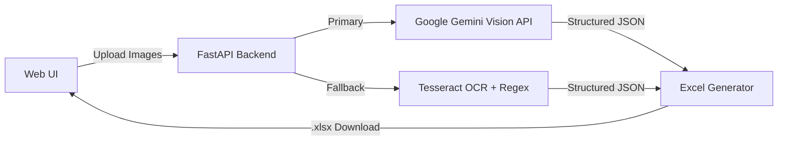

# Bill OCR → Excel Service

Upload photos of bills/invoices, get back a clean, structured Excel file.
It uses **Google Gemini Vision** to read the bill, and falls back to local
**Tesseract OCR** if no Gemini API key is configured.

---

## 🐣 Setup for beginners (step-by-step)

If you've never run a Python web service before, follow these steps exactly, in order, from a terminal opened in this project folder.

### 1. Check Python is installed

```bash
python3 --version
```

You need Python 3.10 or newer. If this command fails, install Python from [python.org](https://www.python.org/downloads/) (or `brew install python3` on macOS).

### 2. Create a virtual environment

A virtual environment keeps this project's packages separate from everything else on your machine.

```bash
python3 -m venv venv
```

This creates a `venv/` folder in the project.

### 3. Activate the virtual environment

```bash
source venv/bin/activate      # macOS/Linux
venv\Scripts\activate         # Windows (Command Prompt)
```

Your terminal prompt should now start with `(venv)`. You'll need to run this activate command every time you open a new terminal to work on the project.

> **Troubleshooting (macOS + Homebrew)**: if step 2 fails with an error mentioning `ensurepip` or `pyexpat`/`XML_SetAllocTrackerActivationThreshold`, your Homebrew Python build is broken. Use a different installed version instead, e.g. `python3.12 -m venv venv` (check what's available with `ls /opt/homebrew/bin/python3.*`), then continue from step 3.

### 4. Install the project's dependencies

```bash
pip install -r requirements.txt
```

This reads `requirements.txt` and installs FastAPI, the Gemini SDK, Tesseract's Python wrapper, Excel generation library, etc.

### 5. (Optional but recommended) Install Tesseract OCR

This is a separate program (not a Python package) used as a fallback when no Gemini API key is set:

```bash
brew install tesseract     # macOS
# or
sudo apt install tesseract-ocr   # Ubuntu/Debian
```

### 6. Set up your Gemini API key

Get a free key from [Google AI Studio](https://aistudio.google.com/apikey). You have two options:

- **Easiest**: skip this step and paste your key directly into the web app's settings panel (⚙️ icon) when it's running — it's saved in your browser.
- **Or**, create a `.env` file so the server always has it:
  ```bash
  cp .env.example .env
  ```
  Then open `.env` and replace `your_api_key_here` with your real key.

### 7. Run the server

```bash
uvicorn app.main:app --reload --port 8000
```

You should see output like `Uvicorn running on http://127.0.0.1:8000`. Keep this terminal window open — closing it stops the server.

### 8. Open the app

Go to **http://localhost:8000** in your browser. Drag a bill photo in, click "Extract Data" to preview it, then "Download Excel" to get your spreadsheet.

To stop the server, press `Ctrl+C` in the terminal.

---

## How it works



1. You upload one or more bill images through the browser.
2. The backend sends each image to Gemini with a request for structured JSON matching our `BillData` schema.
3. If Gemini fails (no key, network error, etc.), the backend runs the image through Tesseract OCR instead and parses the raw text with regex heuristics.
4. The structured data is either shown as a preview table or turned into a styled `.xlsx` workbook (one summary + line-items sheet pair per bill) for download.

## API

- `POST /api/bills/preview` — multipart form (`files`, optional `api_key`) → JSON array of extracted bills.
- `POST /api/bills/workbook` — JSON body: the array returned by `/preview` → streams a `.xlsx` file. Runs no OCR.
- `POST /api/bills/extract` — multipart form, same as `/preview` → streams a `.xlsx` file directly. One-shot convenience path for scripts.

The web UI uses `/preview` then `/workbook`, so previewing and downloading costs a single extraction rather than two.

## Design notes

See **[ARCHITECTURE.md](ARCHITECTURE.md)** for the strategies behind the implementation — the fallback design, why the Pydantic schema doubles as the Gemini prompt, the OCR preprocessing choices — plus known trade-offs and open issues.

## Project structure

```
billOCR/
├── app/
│   ├── main.py               # FastAPI app, CORS, static mount
│   ├── config.py             # Settings (env vars, .env)
│   ├── models.py             # Pydantic schemas
│   ├── routers/bills.py      # API endpoints
│   ├── services/
│   │   ├── gemini_ocr.py     # Gemini Vision extraction
│   │   ├── tesseract_ocr.py  # Tesseract fallback extraction
│   │   └── excel_export.py   # openpyxl Excel generation
│   └── static/                # Frontend (HTML/CSS/JS)
├── uploads/
├── requirements.txt
└── .env.example
```
