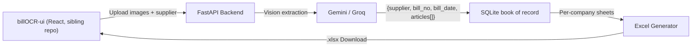

# Bill OCR → Excel Service

API-only backend for turning photos of textile trade bills into a
per-supplier Excel book matching the shop's existing ledger (one sheet per
company/mill, each bill a dated block of product/pcs/rate rows). Uses
**Google Gemini** or **Groq** (Qwen Vision) to read the bill; ingested bills
persist in a local SQLite file so the workbook can always be rebuilt or
re-downloaded later.

The frontend is a separate React app — **billOCR-ui** — in a sibling repo.
This service has no UI of its own; see `FRONTEND.md` for the API contract it
implements.

---

## 🐣 Setup for beginners (step-by-step)

If you've never run a Python web service before, follow these steps exactly, in order, from a terminal opened in this project folder.

### 1. Check Python is installed

```bash
python3 --version
```

You need Python 3.10 or newer. If this command fails, install Python from [python.org](https://www.python.org/downloads/) (or `brew install python3` on macOS).

### 2. Create a virtual environment

A virtual environment keeps this project's packages separate from everything else on your machine.

```bash
python3 -m venv venv
```

This creates a `venv/` folder in the project.

### 3. Activate the virtual environment

```bash
source venv/bin/activate      # macOS/Linux
venv\Scripts\activate         # Windows (Command Prompt)
```

Your terminal prompt should now start with `(venv)`. You'll need to run this activate command every time you open a new terminal to work on the project.

> **Troubleshooting (macOS + Homebrew)**: if step 2 fails with an error mentioning `ensurepip` or `pyexpat`/`XML_SetAllocTrackerActivationThreshold`, your Homebrew Python build is broken. Use a different installed version instead, e.g. `python3.12 -m venv venv` (check what's available with `ls /opt/homebrew/bin/python3.*`), then continue from step 3.

### 4. Install the project's dependencies

```bash
pip install -r requirements.txt
```

This reads `requirements.txt` and installs FastAPI, the Gemini and Groq SDKs, the Excel generation library, etc.

### 5. Set up your Gemini or Groq API key

Get a free key from [Google AI Studio](https://aistudio.google.com/apikey). You have two options:

- **Easiest**: skip this step and paste your key directly into the frontend's settings panel when it's running — it's saved in your browser and sent per-request, never stored server-side.
- **Or**, create a `.env` file so the server always has it:
  ```bash
  cp .env.example .env
  ```
  Then open `.env` and replace `your_api_key_here` with your real key.

### 6. Run the server

```bash
uvicorn app.main:app --reload --port 8000
```

You should see output like `Uvicorn running on http://127.0.0.1:8000`. Keep this terminal window open — closing it stops the server. A `bills.db` SQLite file is created next to the project on first run.

### 7. Run the frontend

This backend has no browsable UI of its own — clone and run **billOCR-ui**
(the sibling frontend repo) separately, pointed at `http://localhost:8000`.
See that repo's README for its own setup steps.

To stop this server, press `Ctrl+C` in the terminal.

---

## How it works



1. You upload one or more bill images through billOCR-ui, optionally naming the supplier up front (see `HANDOVER.md`: supplier is chosen by the user, not read off the image, when given).
2. The backend sends each image to Gemini or Groq, asking it to split the bill's DESCRIPTION column into `company` (mill/brand) and `product` (design name), and return `{supplier, bill_no, bill_date, articles: [{company, product, pcs, rate}]}` — see `output-format.md` for the full contract.
3. Extracted bills are shown as a preview table before anything is saved.
4. On download, each bill is ingested into a local SQLite database keyed by `(supplier, bill_no)` — re-ingesting the same bill replaces its lines rather than duplicating them — and the supplier's full workbook is rebuilt from the database: one sheet per company, each bill a dated block of `product | pcs | rate` rows, plus two optional per-line pricing fields set during review (`final_price`, `margin_pct`) that fill in columns E/F when present — see `ARCHITECTURE.md` for the schema and `output-format.md` for the column mapping.

## API

- `GET /api/bills/providers` — which OCR providers are configured, for the UI dropdown.
- `POST /api/bills/preview` — multipart form (`files`, optional `supplier`, `api_key`, `provider`) → JSON array of extracted bills. Runs no persistence.
- `POST /api/bills/ingest` — JSON body `{results, supplier}` (`results` from `/preview`) → persists into the book of record, returns `{ingested, suppliers}`.
- `GET /api/bills/workbook?supplier=NAME` → streams that supplier's full `.xlsx`, rebuilt from the database.
- `POST /api/bills/extract` — multipart form, same as `/preview` plus ingestion → streams the resulting workbook directly. One-shot convenience path for scripts; requires the batch to resolve to exactly one supplier.

billOCR-ui uses `/preview` then `/ingest` + `/workbook`, so previewing costs a single extraction and the workbook always reflects everything ever ingested for that supplier, not just the current upload.

## Design notes

`ARCHITECTURE.md` documents the current system (DB schema, ingest/idempotency, OCR fallback, the price/margin fields). `implementation_plan.md` describes the original generic-invoice version of this tool and predates the textile-specific schema in `HANDOVER.md`/`output-format.md`/`workflow.md` — treat that one as historical, not current.

## Project structure

```
billOCR/
├── app/
│   ├── main.py               # FastAPI app, CORS, DB init (API-only, no UI)
│   ├── config.py             # Settings (env vars, .env)
│   ├── models.py             # Pydantic schemas (BillExtraction, Article)
│   ├── db.py                 # SQLite book of record (supplier/company/bill/line)
│   ├── routers/bills.py      # API endpoints
│   └── services/
│       ├── gemini_ocr.py     # Gemini Vision extraction
│       ├── groq_ocr.py       # Groq Qwen Vision extraction
│       └── excel_export.py   # openpyxl per-company book-ledger export
├── uploads/
├── requirements.txt
└── .env.example
```

The frontend (billOCR-ui) lives in its own repo, not here.
