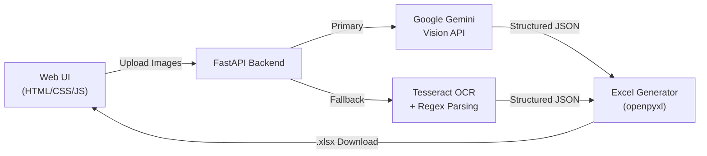

# Bill OCR → Excel Service

A FastAPI-based service with a stunning Web UI that lets users upload bill/invoice images, extracts structured product data using **Google Gemini Vision API** (with **Tesseract OCR** as fallback), and generates downloadable Excel files.

## Architecture Overview



## User Review Required

> [!IMPORTANT]
> **Gemini API Key**: You will need a Google Gemini API key. The app will prompt you to enter it in the UI (stored in browser `localStorage`). You can also set it via the `GEMINI_API_KEY` environment variable or a `.env` file.

> [!IMPORTANT]
> **Tesseract Installation**: For the fallback OCR, Tesseract must be installed on your system:
> ```bash
> brew install tesseract   # macOS
> ```

## Proposed Changes

### Project Structure

```
billOCR/
├── app/
│   ├── __init__.py
│   ├── main.py              # FastAPI app, CORS, mount static
│   ├── config.py             # Settings (env vars, .env)
│   ├── models.py             # Pydantic schemas (LineItem, Bill, etc.)
│   ├── routers/
│   │   └── bills.py          # POST /api/bills/extract endpoint
│   ├── services/
│   │   ├── gemini_ocr.py     # Gemini Vision API extraction
│   │   ├── tesseract_ocr.py  # Tesseract fallback extraction
│   │   └── excel_export.py   # openpyxl Excel generation
│   └── static/               # Frontend files
│       ├── index.html
│       ├── styles.css
│       └── app.js
├── uploads/                  # Temporary uploaded images
├── requirements.txt
├── .env.example
└── README.md
```

---

### Backend — Core Models

#### [NEW] [models.py](file:///Users/ankit/Documents/services/billOCR/app/models.py)

Pydantic models used both for Gemini structured output schema and API responses:

```python
class LineItem(BaseModel):
    serial_no: int | None
    item_name: str
    description: str | None
    hsn_sac_code: str | None
    quantity: float
    unit: str | None           # e.g. "kg", "pcs", "ltr"
    rate: float
    discount: float | None     # percentage or absolute
    tax_rate: float | None     # GST %
    tax_amount: float | None
    total: float

class BillData(BaseModel):
    vendor_name: str | None
    vendor_address: str | None
    bill_number: str | None
    bill_date: str | None
    customer_name: str | None
    line_items: list[LineItem]
    subtotal: float | None
    tax_total: float | None
    grand_total: float | None
    payment_method: str | None
```

The schema is **flexible** — Gemini will auto-detect which fields are present on the bill and fill in `None` for missing fields.

---

### Backend — OCR Services

#### [NEW] [gemini_ocr.py](file:///Users/ankit/Documents/services/billOCR/app/services/gemini_ocr.py)

- Uses `google-genai` SDK with `gemini-2.0-flash` model
- Passes the bill image + a prompt requesting structured extraction
- Uses `response_schema=BillData` for guaranteed structured JSON output
- Returns a `BillData` Pydantic object

#### [NEW] [tesseract_ocr.py](file:///Users/ankit/Documents/services/billOCR/app/services/tesseract_ocr.py)

- Uses `pytesseract` + `Pillow` for image preprocessing (grayscale, threshold)
- Extracts raw text from the bill image
- Uses regex patterns + heuristics to parse common bill fields
- Returns a `BillData` Pydantic object (best-effort, less accurate than Gemini)

---

### Backend — Excel Export

#### [NEW] [excel_export.py](file:///Users/ankit/Documents/services/billOCR/app/services/excel_export.py)

- Creates a professionally styled Excel workbook using `openpyxl`
- **Sheet 1 — "Bill Summary"**: Vendor info, bill number, date, totals
- **Sheet 2 — "Line Items"**: Full item table with headers, borders, alternating row colors
- Applies formatting: bold headers, currency formatting, auto-column widths
- Returns a `BytesIO` buffer for streaming download

---

### Backend — API Router

#### [NEW] [bills.py](file:///Users/ankit/Documents/services/billOCR/app/routers/bills.py)

**`POST /api/bills/extract`**
- Accepts: multipart form with one or more image files + optional `api_key` field
- Flow: Try Gemini first → on failure, fallback to Tesseract → generate Excel → return
- Response: Streams the `.xlsx` file as a download
- Supports processing multiple bills into a single Excel (one sheet per bill)

**`POST /api/bills/preview`**
- Same as extract but returns JSON preview of extracted data (before Excel)
- Lets users review & confirm before downloading

---

### Backend — App Entry

#### [NEW] [main.py](file:///Users/ankit/Documents/services/billOCR/app/main.py)

- FastAPI app with CORS middleware
- Mounts `/static` for the frontend
- Includes the bills router
- Serves `index.html` at root `/`

---

### Frontend — Web UI

#### [NEW] [index.html](file:///Users/ankit/Documents/services/billOCR/app/static/index.html)

Premium, dark-themed single-page app with:
- **Drag-and-drop upload zone** with animated border, file preview thumbnails
- **API key input** (collapsible settings panel, saved to localStorage)
- **Live extraction preview** showing parsed data in a styled table before export
- **Download button** for the generated Excel file
- Responsive layout (mobile-friendly)

#### [NEW] [styles.css](file:///Users/ankit/Documents/services/billOCR/app/static/styles.css)

- Dark glassmorphism theme with gradient accents
- CSS custom properties for the design system
- Smooth micro-animations (upload zone pulse, loading spinner, success checkmark)
- Google Fonts (Inter)
- Responsive grid layout

#### [NEW] [app.js](file:///Users/ankit/Documents/services/billOCR/app/static/app.js)

- Drag-and-drop + click-to-browse file handling
- Image preview with thumbnails
- Fetch API calls to `/api/bills/preview` then `/api/bills/extract`
- Dynamic table rendering of extracted bill data
- Excel download trigger
- Error handling with toast notifications
- Loading states with skeleton animations

---

### Configuration & Setup

#### [NEW] [requirements.txt](file:///Users/ankit/Documents/services/billOCR/requirements.txt)

```
fastapi>=0.115.0
uvicorn[standard]>=0.30.0
python-multipart>=0.0.9
google-genai>=1.0.0
Pillow>=10.0.0
pytesseract>=0.3.10
openpyxl>=3.1.0
python-dotenv>=1.0.0
```

#### [NEW] [.env.example](file:///Users/ankit/Documents/services/billOCR/.env.example)

```
GEMINI_API_KEY=your_api_key_here
```

#### [NEW] [README.md](file:///Users/ankit/Documents/services/billOCR/README.md)

Setup instructions, usage guide, and API documentation.

---

## Verification Plan

### Automated Tests
```bash
# Install dependencies
pip install -r requirements.txt

# Run the server
uvicorn app.main:app --reload --port 8000
```

### Manual Verification
1. Open `http://localhost:8000` in the browser
2. Upload a sample bill image
3. Verify extracted data appears in the preview table
4. Click "Download Excel" and verify the `.xlsx` file opens correctly
5. Test with Tesseract fallback by omitting the API key
